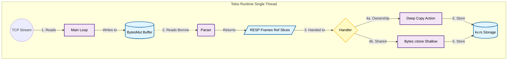

# Rustis

A key-value, in-memory database server written in Rust. The goal is to beat Redis on throughput by leveraging multi-threading and Rust's 'fearless concurrency'. 

Currently, the sever is running single-threaded (same as Redis). The plan is to move to a per-core shared-nothing multi-threaded architecture. Theoretically should get much more throughput; esssentially an architectural copy of more modern alternatives like Dragonfly.

## Quick Start

Install `redis` with any package manager of choice then run

```bash
cargo run --release

```
and in another terminal window, run the benchmark or `redis-cli` to test

## Benchmark Test Suite

in `benchmark.py` ther are there are four tests 

1. sanity check, just making sure the server works 

2. regular, baseline load (not much stress on the server)

3. High concurrency and throughput with 2000 clients, 32 pipelined requests, and 1 million requests

4. Same as test 3 but with heavy payloads (4KB) 

run these tests with a python runtime (I suggest uv and `uv run benchmark.py`)

> [!NOTE]
> You may have to run `ulimit -n 10000` to allow 2000 concurrent clients!

Running `benchmark.py` will give you the an option to save to a csv. If you wish to benchmark your own, delete the existing csv file. 

Running `generate_report.py` will give you an option to print out a table comparing different test runs

--- 

## Supported Commands

Currently the following commands are supported: 

- Basic: `GET`, `SET`

- List: `LPUSH`, `RPUSH`, `RPOP`, `LPOP`, `LRANGE`

- Set: `SADD`, `SPOP`, `SMEMBERS`

---

# Current Benchmarks

## Redis Baseline (official redis-server benchmarks)

|Test Name                            |Command|RPS       |Latency (p50)|
|-------------------------------------|-------|----------|-------------|
|Regular Load (Baseline)              |SET    |236686.38 |0.111        |
|Regular Load (Baseline)              |GET    |245700.25 |0.111        |
|High Concurrency & Throughput (Mixed)|SET    |874890.62 |76.351       |
|High Concurrency & Throughput (Mixed)|GET    |2857143.00|18.351       |
|High Concurrency & Throughput (Mixed)|LPUSH  |2525252.50|21.615       |
|High Concurrency & Throughput (Mixed)|LPOP   |2450980.50|22.367       |
|Heavy Payload Saturation (4KB)       |SET    |480769.25 |9.919        |
|Heavy Payload Saturation (4KB)       |GET    |618811.88 |19.535       |

---

## single_thread_v4

1. zero copy parsing in the parser

2. clone on owned values, no copy 

3. optimize release compile profile 

4. use jemalloc for memory allocation

### single_thread_v4 vs single_thread_v3


| Test Name | Cmd | RPS | Δ RPS | Latency (ms) | Δ Lat |
| :--- | :--- | :--- | :--- | :--- | :--- |
| High Concurrency & Throughput (Mixed) | SET | 2,500,000 | 🟢 +104.00% | 22.911 | 🟢 -47.74% |
| High Concurrency & Throughput (Mixed) | GET | 2,421,308 | 🔴 -1.21% | 23.311 | 🔴 +1.25% |
| High Concurrency & Throughput (Mixed) | LPUSH | 3,521,127 | 🟢 +57.04% | 15.831 | 🟢 -39.15% |
| High Concurrency & Throughput (Mixed) | LPOP | 3,831,418 | 🟢 +38.70% | 13.999 | 🟢 -32.28% |
| High Concurrency & Throughput (Mixed) | SADD | 2,309,469 | 🟢 +22.17% | 26.159 | 🟢 -17.01% |
| High Concurrency & Throughput (Mixed) | SPOP | 2,024,292 | 🟢 +16.19% | 12.527 | 🟢 -24.71% |
| Heavy Payload Saturation (4KB) | SET | 472,590 | 🟢 +4.44% | 31.199 | 🟢 -7.85% |
| Heavy Payload Saturation (4KB) | GET | 794,913 | 🟢 +0.32% | 17.375 | 🟢 -4.40% |

### single_thread_v4 vs redis baseline


| Test Name | Cmd | RPS | Δ RPS | Latency (ms) | Δ Lat |
| :--- | :--- | :--- | :--- | :--- | :--- |
| High Concurrency & Throughput (Mixed) | SET | 2,500,000 | 🟢 +183.00% | 22.911 | 🟢 -69.99% |
| High Concurrency & Throughput (Mixed) | GET | 2,421,308 | 🔴 -15.50% | 23.311 | 🔴 +27.70% |
| High Concurrency & Throughput (Mixed) | LPUSH | 3,521,127 | 🟢 +36.62% | 15.831 | 🟢 -25.15% |
| High Concurrency & Throughput (Mixed) | LPOP | 3,831,418 | 🟢 +57.47% | 13.999 | 🟢 -38.56% |
| High Concurrency & Throughput (Mixed) | SADD | 2,309,469 | 🔴 -11.55% | 26.159 | 🔴 +27.94% |
| High Concurrency & Throughput (Mixed) | SPOP | 2,024,292 | 🔴 -37.25% | 12.527 | 🟢 -5.32% |
| Heavy Payload Saturation (4KB) | SET | 472,590 | 🔴 -3.12% | 31.199 | 🔴 +220.75% |
| Heavy Payload Saturation (4KB) | GET | 794,913 | 🟢 +31.64% | 17.375 | 🟢 -16.65% |

---

# Code Architecture 

## Current Architecture

it all runs on single thread, tokio 

1. main reads from tcp stream into a BytesMut

2. parser reads as many RESP frames as possible, returning BytesMut reference slices (not owned) 
 
3. the read frame is then handed to the handler

4. the handler, depending on the command will decide whether to .clone() or deep copy 

5. the cloned (or deep copied) values are handed off to the kv.rs (key-value) and stored 




## Future Optimizations / Considerations

This is an ongoing project, and I am exploring the following options 

- tinkering and optimizing with single-threaded performance (currently doing)

- moving to a multi-threaded IO but single-threaded database engine architecture 

- moving to fully multi-threaded, shared nothing

- moving to a multi-threaded IO but single-threaded database engine architecture 

- moving to fully multi-threaded, shared nothing
