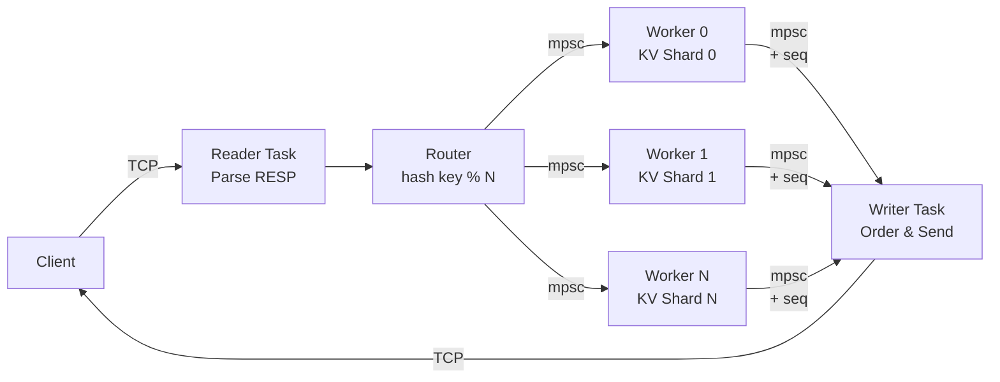

# Rustis

A high-performance, in-memory key-value database that **achieves 3.7M ops/sec** - outperforming Redis by up to 236% on high-concurrency workloads.

Currently, the server is multi-threaded with a fan-in / fan-out model. It is not as performant as the single-threaded version (check branch `single_thread`) due to sync overhead.

This is an ongoing project, and the plan is to adopt DragonflyDB's shared-nothing architecture. 

## Why Rustis?
Redis is single-threaded by design. Modern servers have 64+ cores going unused. Rustis explores whether a multi-threaded, shared-nothing architecture can unlock that potential while maintaining Redis simplicity.

## Current Status
✅ Single-threaded with async I/O (beating Redis baseline)

🚧 Multi-threaded shared-nothing architecture (in progress)

## Key Optimizations
- **Zero-copy parsing**: Slice references avoid allocations for reads
- **Bytes Crate**: for effiicent cloning and avoiding any unnecessary owned values
- **jemalloc**: Use jemallocator for more performant malloc calls 


## Quick Start

Install `redis` with any package manager of choice then run

```bash
cargo run --release

```
and in another terminal window, run the benchmark or `redis-cli` to test

## Benchmark Test Suite

in `benchmark.py` ther are there are four tests 

1. sanity check, just making sure the server works 

2. regular, baseline load (not much stress on the server)

3. High concurrency and throughput with 2000 clients, 32 pipelined requests, and 1 million requests

4. Same as test 3 but with heavy payloads (4KB) 

run these tests with a python runtime (I suggest uv and `uv run benchmark.py`)

> [!NOTE]
> You may have to run `ulimit -n 10000` to allow 2000 concurrent clients!

Running `benchmark.py` will give you the an option to save to a csv. If you wish to benchmark your own, delete the existing csv file. 

Running `generate_report.py` will give you an option to print out a table comparing different test runs

--- 

## Supported Commands

Currently the following commands are supported: 

- Basic: `GET`, `SET`

- List: `LPUSH`, `RPUSH`, `RPOP`, `LPOP`, `LRANGE`

- Set: `SADD`, `SPOP`, `SMEMBERS`

---

# Current Benchmarks

## Redis Baseline (official redis-server benchmarks)

|Test Name                            |Command|RPS       |Latency (p50)|
|-------------------------------------|-------|----------|-------------|
|Regular Load (Baseline)              |SET    |236686.38 |0.111        |
|Regular Load (Baseline)              |GET    |245700.25 |0.111        |
|High Concurrency & Throughput (Mixed)|SET    |874890.62 |76.351       |
|High Concurrency & Throughput (Mixed)|GET    |2857143.00|18.351       |
|High Concurrency & Throughput (Mixed)|LPUSH  |2525252.50|21.615       |
|High Concurrency & Throughput (Mixed)|LPOP   |2450980.50|22.367       |
|Heavy Payload Saturation (4KB)       |SET    |480769.25 |9.919        |
|Heavy Payload Saturation (4KB)       |GET    |618811.88 |19.535       |

---

## multithread_v1 vs Redis Baseline 


| Test Name | Cmd | RPS | Δ RPS | Latency (ms) | Δ Lat |
| :--- | :--- | :--- | :--- | :--- | :--- |
| High Concurrency & Throughput (Mixed) | SET | 621,118 | 🔴 -29.69% | 99.455 | 🔴 +30.26% |
| High Concurrency & Throughput (Mixed) | GET | 636,943 | 🔴 -77.77% | 97.919 | 🔴 +436.40% |
| High Concurrency & Throughput (Mixed) | LPUSH | 2,469,136 | 🔴 -4.20% | 23.119 | 🔴 +9.30% |
| High Concurrency & Throughput (Mixed) | LPOP | 2,444,988 | 🟢 +0.49% | 21.215 | 🟢 -6.88% |
| High Concurrency & Throughput (Mixed) | SADD | 3,215,434 | 🟢 +23.15% | 17.759 | 🟢 -13.15% |
| High Concurrency & Throughput (Mixed) | SPOP | 1,540,832 | 🔴 -52.23% | 21.183 | 🔴 +60.10% |
| Heavy Payload Saturation (4KB) | SET | 392,157 | 🔴 -19.61% | 37.759 | 🔴 +288.19% |
| Heavy Payload Saturation (4KB) | GET | 373,692 | 🔴 -38.12% | 39.423 | 🔴 +89.11% |


- currently, we are *worse* than the single_threaded architecture (check branch `single_thread` for details on the optimized, single-threaded version)

---

# Code Architecture

- we are using a fan-out / fan-in model 

1. an async thread (single-threaded) IO thread is spawned, and each thread has a asynchronous worker and writer task (each connection gets a thread)

2. N synchronous threads (where N = # of cpu cores) 

3. `reader_task` parses, and then hands it off to `router.rs`

4. `router.rs` checks the key, hashes it, and then hands the parsed response to the worker that owns that hash through the mpsc channel 

5. the worker processes and interacts with its owned key-value store, and then sends the response value to the writer task

6. `writer_task` is awaiting on its tx and orders the responses according to the `seq` values, then writes 



## Drawbacks / Performance Penalties 

we are *much* worse than single-threaded because 

- the overhead for synchronization between threads is very high (synch overhead for **every** request adds up)

- cache line bouncing because of the shared memory structures (MPSC internals, message data bouncing around threads, sequence number tracking)

- Head-of-line blocking if a worker that owns the cache is busy 

- coordinator thread can become the bottleneck

Meanwhile, the single-threaded iteration avoided all of these problems

- No sync overhead 

- No channel communication penalties

- perfect cache locality, and no context switching 

We are getting the worst parts of both single-thread *and* multi-threading because 

1. IO is still serializing all coordinatio 

2. each request pays the a big round trip penalty (io -> worker -> io)

3. pipelining doesn't really work well with workers 

4. each redis request is small, so the work 'unit' doesn't justify the cost of coordination

### Next Steps 

I will look to implement true shared-nothing architecture, dragonflyDB style where: 

- we spawn N threads for N cores 

- each thread actually owns its own IO 

- essentially N single-threaded versions running 

This should avoid: 

- sync overhead -> Only if keys do not belong to a thread will there be communication, but not for every requeset

- cache line bouncing -> no shared memeory structures, especially the MPSC internals 

- coordinator thread will not be a bottleneck because each thread is responsible for their own read and writes 

Gotta follow **KISS**: keep it simple, stupid. I learned a lot from implementing this actor model, but ultimately the complexity actually makes it worse! 
