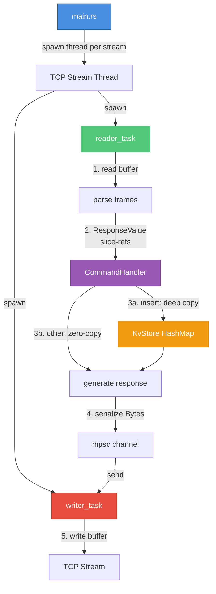

# Rustis

A key-value, in-memory database server written in Rust. The goal is to beat Redis on throughput by leveraging multi-threading and Rust's 'fearless concurrency'. 

Currently, the sever is running single-threaded (same as Redis). The plan is to move to a per-core shared-nothing multi-threaded architecture. Theoretically should get much more throughput; esssentially an architectural copy of more modern alternatives like Dragonfly.

## Quick Start

Install `redis` with any package manager of choice then run

```bash
cargo run --release

```
and in another terminal window, run the benchmark or `redis-cli` to test

## Benchmark Test Suite

in `benchmark.py` ther are there are four tests 

1. sanity check, just making sure the server works 

2. regular, baseline load (not much stress on the server)

3. High concurrency and throughput with 2000 clients, 32 pipelined requests, and 1 million requests

4. Same as test 3 but with heavy payloads (4KB) 

run these tests with a python runtime (I suggest uv and `uv run benchmark.py`)

> [!NOTE]
> You may have to run `ulimit -n 10000` to allow 2000 concurrent clients!

Running `benchmark.py` will give you the an option to save to a csv. If you wish to benchmark your own, delete the existing csv file. 

Running `generate_report.py` will give you an option to print out a table comparing different test runs

--- 

## Supported Commands

Currently the following commands are supported: 

- Basic: `GET`, `SET`

- List: `LPUSH`, `RPUSH`, `RPOP`, `LPOP`, `LRANGE`

- Set: `SADD`, `SPOP`, `SMEMBERS`

---

# Current Benchmarks

## Redis Baseline (official redis-server benchmarks)

|Test Name                            |Command|RPS       |Latency (p50)|
|-------------------------------------|-------|----------|-------------|
|Regular Load (Baseline)              |SET    |236686.38 |0.111        |
|Regular Load (Baseline)              |GET    |245700.25 |0.111        |
|High Concurrency & Throughput (Mixed)|SET    |874890.62 |76.351       |
|High Concurrency & Throughput (Mixed)|GET    |2857143.00|18.351       |
|High Concurrency & Throughput (Mixed)|LPUSH  |2525252.50|21.615       |
|High Concurrency & Throughput (Mixed)|LPOP   |2450980.50|22.367       |
|Heavy Payload Saturation (4KB)       |SET    |480769.25 |9.919        |
|Heavy Payload Saturation (4KB)       |GET    |618811.88 |19.535       |

---

## single_thread_v5

1. reading and writing are now two seperate async tasks that communicate through mpsc

- at this point, I think i've optimized single_thread as much as possible

- only thing left is to have a proper implementation of SPOP (currently a O(N) scan)

- next steps would be to move to shared-nothing, true multi-threading

### single_thread_v5 vs redis basline

| Test Name | Cmd | RPS | Δ RPS | Latency (ms) | Δ Lat |
| :--- | :--- | :--- | :--- | :--- | :--- |
| High Concurrency & Throughput (Mixed) | SET | 2,941,176 | 🟢 +232.94% | 17.839 | 🟢 -76.64% |
| High Concurrency & Throughput (Mixed) | GET | 2,976,190 | 🟢 +3.87% | 17.343 | 🟢 -5.00% |
| High Concurrency & Throughput (Mixed) | LPUSH | 3,448,276 | 🟢 +33.79% | 15.487 | 🟢 -26.78% |
| High Concurrency & Throughput (Mixed) | LPOP | 3,731,343 | 🟢 +53.36% | 14.055 | 🟢 -38.31% |
| High Concurrency & Throughput (Mixed) | SADD | 2,958,580 | 🟢 +13.31% | 17.967 | 🟢 -12.13% |
| High Concurrency & Throughput (Mixed) | SPOP | 2,074,689 | 🔴 -35.68% | 11.599 | 🟢 -12.33% |
| Heavy Payload Saturation (4KB) | SET | 627,353 | 🟢 +28.61% | 22.431 | 🔴 +130.61% |
| Heavy Payload Saturation (4KB) | GET | 723,589 | 🟢 +19.83% | 19.327 | 🟢 -7.29% |


---

# Code Architecture 

## Current Architecture

**Main Flow**
1. `main.rs` spawns a thread for each TCP stream
2. each TCP stream spawns two threads: 
	1. `writer_task`: writes to the write buffer
	2. `reader_task`: reads the request and interacts with database, then communicates through mpsc channel 

**Parsing Flow**
1. the `reader_task` reads into a buffer, and parses as many frames as possible, then sends through transmitter 
2. when a frame is parsed by `parse()`, it returns a ResponseValue that is then handled by the `CommandHandler`
	- the `ResponseValue` enum holds `Bytes` where the `parse()` will store a slice-reference (for zero-copying)
3. the `CommandHandler` will then deep copy values and hand it to `KvStore` to be stored in the hashmap 
4. zero-copy references used for any non-insert command 
5. the `CommandHandler` returns a response that is serialized into `Bytes` and send over the mspc channel to `writer_task`
6. `writer_task` writes to the read buffer




## Future Optimizations / Considerations

This is an ongoing project, and I am exploring the following options 

- tinkering and optimizing with single-threaded performance (currently doing)

- moving to a multi-threaded IO but single-threaded database engine architecture 

- moving to fully multi-threaded, shared nothing

- moving to a multi-threaded IO but single-threaded database engine architecture 

- moving to fully multi-threaded, shared nothing
