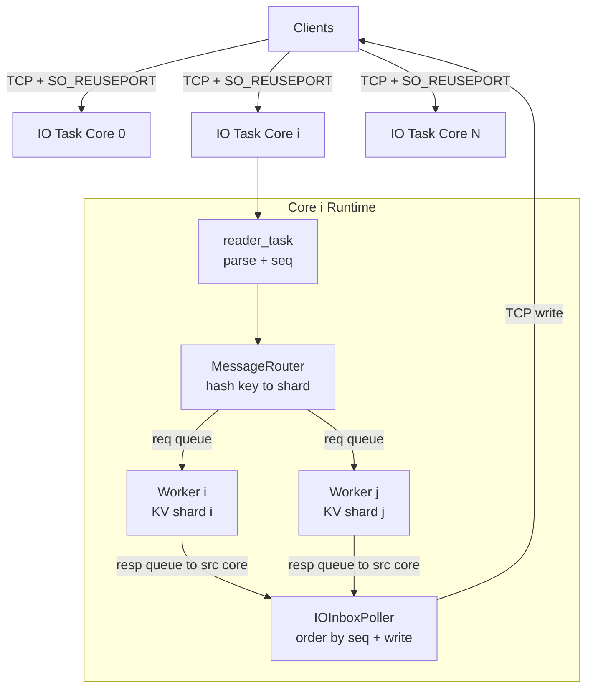

# Rustis

A high-performance, in-memory key-value database that **achieves 3.7M ops/sec** - outperforming Redis by up to 236% on high-concurrency workloads.

> [!NOTE]
> Currently, the server is multi-threaded with a fan-in / fan-out model. It is not as performant as the single-threaded version (check branch `single_thread`) due to sync overhead.

This is an ongoing project, and the plan is to adopt DragonflyDB's shared-nothing architecture. 

## Why Rustis?
Redis is single-threaded by design. Modern servers have 64+ cores going unused. Rustis explores whether a multi-threaded, shared-nothing architecture can unlock that potential while maintaining Redis simplicity.

## Current Status
✅ Single-threaded with async I/O (beating Redis baseline)

🚧 Multi-threaded shared-nothing architecture (in progress)

## Key Optimizations
- **Zero-copy parsing**: Slice references avoid allocations for reads
- **Bytes Crate**: for effiicent cloning and avoiding any unnecessary owned values
- **jemalloc**: Use jemallocator for more performant malloc calls 


## Quick Start

Install `redis` with any package manager of choice then run

```bash
cargo run --release

```
and in another terminal window, run the benchmark or `redis-cli` to test

## Benchmark Test Suite

in `benchmark.py` ther are there are four tests 

1. sanity check, just making sure the server works 

2. regular, baseline load (not much stress on the server)

3. High concurrency and throughput with 2000 clients, 32 pipelined requests, and 1 million requests

4. Same as test 3 but with heavy payloads (4KB) 

run these tests with a python runtime (I suggest uv and `uv run benchmark.py`)

> [!NOTE]
> You may have to run `ulimit -n 10000` to allow 2000 concurrent clients!

Running `benchmark.py` will give you the an option to save to a csv. If you wish to benchmark your own, delete the existing csv file. 

Running `generate_report.py` will give you an option to print out a table comparing different test runs

--- 

## Supported Commands

Currently the following commands are supported: 

- Basic: `GET`, `SET`

- List: `LPUSH`, `RPUSH`, `RPOP`, `LPOP`, `LRANGE`

- Set: `SADD`, `SPOP`, `SMEMBERS`

---

# Current Benchmarks

## Redis Baseline (official redis-server benchmarks)

|Test Name                            |Command|RPS       |Latency (p50)|
|-------------------------------------|-------|----------|-------------|
|Regular Load (Baseline)              |SET    |236686.38 |0.111        |
|Regular Load (Baseline)              |GET    |245700.25 |0.111        |
|High Concurrency & Throughput (Mixed)|SET    |874890.62 |76.351       |
|High Concurrency & Throughput (Mixed)|GET    |2857143.00|18.351       |
|High Concurrency & Throughput (Mixed)|LPUSH  |2525252.50|21.615       |
|High Concurrency & Throughput (Mixed)|LPOP   |2450980.50|22.367       |
|Heavy Payload Saturation (4KB)       |SET    |480769.25 |9.919        |
|Heavy Payload Saturation (4KB)       |GET    |618811.88 |19.535       |

---

## multithread_v1 vs Redis Baseline 


| Test Name | Cmd | RPS | Δ RPS | Latency (ms) | Δ Lat |
| :--- | :--- | :--- | :--- | :--- | :--- |
| High Concurrency & Throughput (Mixed) | SET | 621,118 | 🔴 -29.69% | 99.455 | 🔴 +30.26% |
| High Concurrency & Throughput (Mixed) | GET | 636,943 | 🔴 -77.77% | 97.919 | 🔴 +436.40% |
| High Concurrency & Throughput (Mixed) | LPUSH | 2,469,136 | 🔴 -4.20% | 23.119 | 🔴 +9.30% |
| High Concurrency & Throughput (Mixed) | LPOP | 2,444,988 | 🟢 +0.49% | 21.215 | 🟢 -6.88% |
| High Concurrency & Throughput (Mixed) | SADD | 3,215,434 | 🟢 +23.15% | 17.759 | 🟢 -13.15% |
| High Concurrency & Throughput (Mixed) | SPOP | 1,540,832 | 🔴 -52.23% | 21.183 | 🔴 +60.10% |
| Heavy Payload Saturation (4KB) | SET | 392,157 | 🔴 -19.61% | 37.759 | 🔴 +288.19% |
| Heavy Payload Saturation (4KB) | GET | 373,692 | 🔴 -38.12% | 39.423 | 🔴 +89.11% |


- currently, we are *worse* than the single_threaded architecture (check branch `single_thread` for details on the optimized, single-threaded version)

---

# Code Architecture

- current model is **N-thread sharded execution**, where `N = number of CPU cores`

1. `main -> spawn_threads()` creates one OS thread per core (core-pinned on Linux, max priority when available)

2. each core thread creates:
   - a single-thread Tokio runtime (`LocalSet`)
   - one local `WorkerTask` with its own `KvStore` shard
   - one local I/O task (`spawn_io`) that accepts and manages TCP connections for that core

3. request/response transport is a **full mesh** of bounded lock-free ring buffers (`rtrb`):
   - request mesh: `req_txs[src][dst]` / `req_rxs[dst][src]` for `WorkerMessage`
   - response mesh: `resp_txs[src][dst]` / `resp_rxs[dst][src]` for `ResponseMessage`
   - each destination side has a `TaskNotifier` doorbell for wakeups

4. in each connection `reader_task`:
   - parses RESP frames (`parser.rs`)
   - attaches a per-connection `seq` number
   - routes via `router.rs`

5. routing behavior (`MessageRouter`):
   - command key is hashed to pick destination worker shard
   - keyed commands (`GET/SET/...`) go to owning worker core
   - direct replies (e.g. `PING`, protocol errors, malformed input) are sent to the source core's worker queue

6. worker behavior (`worker.rs`):
   - polls all inbound request queues for that worker core
   - executes command handlers against its local shard (`handler.rs` + `kv.rs`)
   - sends `ResponseMessage` back to the originating I/O core (`src_core`)

7. response write path (`IOInboxPoller` in `connection.rs`):
   - polls all inbound response queues for that I/O core
   - maps `conn_token -> ConnectionState`
   - enqueues responses by `seq` and flushes in order
   - uses a fixed ordering window (`WINDOW_SIZE = 1024`) to preserve pipeline ordering


```mermaid
flowchart TD
    Client[Clients] -->|TCP + SO_REUSEPORT| IO0[IO Task Core 0]
    Client -->|TCP + SO_REUSEPORT| IOi[IO Task Core i]
    Client -->|TCP + SO_REUSEPORT| ION[IO Task Core N]

    subgraph Core_i[Core i Runtime]
        Reader[reader_task<br/>parse + seq] --> Router[MessageRouter<br/>hash key to shard]
        Router -->|req queue| Wi[Worker i<br/>KV shard i]
        Router -->|req queue| Wj[Worker j<br/>KV shard j]
        Wi -->|resp queue to src core| Poller[IOInboxPoller<br/>order by seq + write]
        Wj -->|resp queue to src core| Poller
    end

    IOi --> Reader
    Poller -->|TCP write| Client
```

## Current Tradeoffs

- every request still crosses async task + queue boundaries (`reader -> router -> worker -> io writer`)
- cross-core routing for non-local keys adds queue traffic and wakeup overhead
- preserving per-connection ordering adds buffering and sequencing work on the write side
- bounded queues and fixed response windows require backpressure discipline under extreme pipelining

This is no longer a single coordinator-thread fan-in/fan-out design; it is a per-core runtime with sharded state and cross-core message passing.

### Future Optimizations (multithread_V3)

**Major Changes**:
- allow for local execution on keys that hash to the same core 
- pass function pointers instead of actual values to avoid mallocing everywhere 
- batch operations, avoid multiple wakeups / round trips
- avoid key / value cloning in hot paths, keep borrowed values as long as possible 

**Minor Changes**:
- pass in hashed values into hashmap, avoid hashing twice 
- command dispatch table instead of if-else or branching 
- networking: use vectored writes and check that SO_REUSEPORT is actually even / fair 
