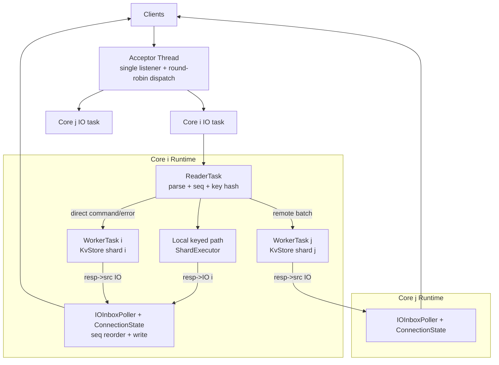

# Rustis

A high-performance, in-memory key-value database that **achieves 3.7M ops/sec** - outperforming Redis by up to 236% on high-concurrency workloads.

> [!NOTE]
> Currently, the server is multi-threaded with a fan-in / fan-out model. It is not as performant as the single-threaded version (check branch `single_thread`) due to sync overhead.

This is an ongoing project, and the plan is to adopt DragonflyDB's shared-nothing architecture. 

## Why Rustis?
Redis is single-threaded by design. Modern servers have 64+ cores going unused. Rustis explores whether a multi-threaded, shared-nothing architecture can unlock that potential while maintaining Redis simplicity.

## Current Status
✅ Single-threaded with async I/O (beating Redis baseline)

🚧 Multi-threaded shared-nothing architecture (in progress)

## Key Optimizations
- **Zero-copy RESP parsing**: `parser.rs` uses `Bytes` slices instead of copying payloads.
- **Sharded state per core**: each `ShardExecutor` owns a local `KvStore`, avoiding cross-core locks.
- **Lock-free inter-core queues**: request/response traffic uses bounded `rtrb` rings.
- **Batched queue flushes**: reader/worker paths batch by destination (`BATCH_SIZE=64`) to reduce wakeups.
- **Wake-on-demand polling**: `TaskNotifier` only wakes sleeping tasks, avoiding busy loops.
- **Write-side ordering window**: `ConnectionState` keeps a fixed `WINDOW_SIZE=1024` sequence buffer for pipelined response ordering with low overhead.
- **Allocator/runtime tuning**: `jemalloc`, LTO, single `codegen-units`, and `panic=abort` are enabled for release builds.


## Quick Start

Install `redis` with any package manager of choice then run

```bash
cargo run --release

```
and in another terminal window, run the benchmark or `redis-cli` to test

## Benchmark Test Suite

in `benchmark.py` ther are there are four tests 

1. sanity check, just making sure the server works 

2. regular, baseline load (not much stress on the server)

3. High concurrency and throughput with 2000 clients, 32 pipelined requests, and 1 million requests

4. Same as test 3 but with heavy payloads (4KB) 

run these tests with a python runtime (I suggest uv and `uv run benchmark.py`)

> [!NOTE]
> You may have to run `ulimit -n 10000` to allow 2000 concurrent clients!

Running `benchmark.py` will give you the an option to save to a csv. If you wish to benchmark your own, delete the existing csv file. 

Running `generate_report.py` will give you an option to print out a table comparing different test runs

--- 

## Supported Commands

Currently the following commands are supported: 

- Basic: `GET`, `SET`

- List: `LPUSH`, `RPUSH`, `RPOP`, `LPOP`, `LRANGE`

- Set: `SADD`, `SPOP`, `SMEMBERS`

---

# Benchmarks

## multithread vs Redis Baseline 

| Test Name | Cmd | RPS | Δ RPS | Latency (ms) | Δ Lat |
| :--- | :--- | :--- | :--- | :--- | :--- |
| High Concurrency & Throughput (Mixed) | SET | 1,369,863 | 🟢 +55.07% | 21.263 | 🟢 -72.15% |
| High Concurrency & Throughput (Mixed) | GET | 1,396,648 | 🔴 -51.26% | 20.607 | 🔴 +12.88% |
| High Concurrency & Throughput (Mixed) | LPUSH | 2,551,020 | 🔴 -1.02% | 11.999 | 🟢 -43.27% |
| High Concurrency & Throughput (Mixed) | LPOP | 2,645,503 | 🟢 +8.73% | 11.303 | 🟢 -50.39% |
| High Concurrency & Throughput (Mixed) | SADD | 2,949,852 | 🟢 +12.98% | 10.583 | 🟢 -48.24% |
| High Concurrency & Throughput (Mixed) | SPOP | 3,115,265 | 🔴 -3.43% | 9.151 | 🟢 -30.84% |
| Heavy Payload Saturation (4KB) | SET | 442,870 | 🔴 -9.21% | 16.319 | 🔴 +67.77% |
| Heavy Payload Saturation (4KB) | GET | 433,276 | 🔴 -28.25% | 9.239 | 🟢 -55.68% |


## singlethread vs Redis Baseline

| Test Name | Cmd | RPS | Δ RPS | Latency (ms) | Δ Lat |
| :--- | :--- | :--- | :--- | :--- | :--- |
| High Concurrency & Throughput (Mixed) | SET | 2,941,176 | 🟢 +232.94% | 17.839 | 🟢 -76.64% |
| High Concurrency & Throughput (Mixed) | GET | 2,976,190 | 🟢 +3.87% | 17.343 | 🟢 -5.00% |
| High Concurrency & Throughput (Mixed) | LPUSH | 3,448,276 | 🟢 +33.79% | 15.487 | 🟢 -26.78% |
| High Concurrency & Throughput (Mixed) | LPOP | 3,731,343 | 🟢 +53.36% | 14.055 | 🟢 -38.31% |
| High Concurrency & Throughput (Mixed) | SADD | 2,958,580 | 🟢 +13.31% | 17.967 | 🟢 -12.13% |
| High Concurrency & Throughput (Mixed) | SPOP | 2,074,689 | 🔴 -35.68% | 11.599 | 🟢 -12.33% |
| Heavy Payload Saturation (4KB) | SET | 627,353 | 🟢 +28.61% | 22.431 | 🔴 +130.61% |
| Heavy Payload Saturation (4KB) | GET | 723,589 | 🟢 +19.83% | 19.327 | 🟢 -7.29% |


## multithread vs singlethread

| Test Name | Cmd | RPS | Δ RPS | Latency (ms) | Δ Lat |
| :--- | :--- | :--- | :--- | :--- | :--- |
| High Concurrency & Throughput (Mixed) | SET | 1,369,863 | 🔴 -53.42% | 21.263 | 🔴 +19.19% |
| High Concurrency & Throughput (Mixed) | GET | 1,396,648 | 🔴 -53.07% | 20.607 | 🔴 +18.82% |
| High Concurrency & Throughput (Mixed) | LPUSH | 2,551,020 | 🔴 -26.02% | 11.999 | 🟢 -22.52% |
| High Concurrency & Throughput (Mixed) | LPOP | 2,645,503 | 🔴 -29.10% | 11.303 | 🟢 -19.58% |
| High Concurrency & Throughput (Mixed) | SADD | 2,949,852 | 🔴 -0.29% | 10.583 | 🟢 -41.10% |
| High Concurrency & Throughput (Mixed) | SPOP | 3,115,265 | 🟢 +50.16% | 9.151 | 🟢 -21.11% |
| Heavy Payload Saturation (4KB) | SET | 442,870 | 🔴 -29.41% | 16.319 | 🟢 -27.25% |
| Heavy Payload Saturation (4KB) | GET | 433,276 | 🔴 -40.12% | 9.239 | 🟢 -52.20% |


---

# Code Architecture

Current model is **N-thread sharded execution**, where `N = number of CPU cores`.

1. `main -> spawn_threads()` starts:
   - one acceptor thread with a single TCP listener
   - one worker/IO OS thread per core (core-pinned on Linux, max priority when available)

2. Each core thread creates a single-thread Tokio runtime (`LocalSet`) and spawns:
   - `WorkerTask` (`src/worker.rs`) for command execution on that core's shard
   - `spawn_io` (`src/io/spawn_io.rs`) for connection lifecycle and writeback polling

3. Inter-core transport is a **full mesh** of bounded lock-free ring buffers (`rtrb`):
   - request mesh: `req_txs[src][dst]` / `req_rxs[dst][src]` (`WorkerMessage`)
   - response mesh: `resp_txs[src][dst]` / `resp_rxs[dst][src]` (`ResponseMessage`)
   - each destination has a `TaskNotifier` doorbell for wake-on-demand polling

4. Reader path (`src/io/reader_task.rs`) per connection:
   - parses RESP frames from a reusable `BytesMut` buffer (`src/parser.rs`)
   - attaches monotonically increasing per-connection `seq`
   - hashes command key to pick destination core

5. Routing behavior:
   - local keyed request: execute inline via local `ShardExecutor`, then send response to local IO queue
   - remote keyed request: batch and forward `WorkerMessage` to destination worker queue
   - direct replies (`PING`, parse/protocol errors): enqueue to local worker queue for uniform response path

6. Worker path (`src/worker.rs`):
   - drains all inbound request queues with per-queue quotas
   - executes command handlers (`src/handler.rs`) against local `KvStore` shard (`src/kv.rs`)
   - batches responses by destination IO core and flushes round-robin

7. Write path (`src/io/io_poller.rs` + `src/io/connection_state.rs`):
   - drains inbound response queues into per-connection state (`conn_token`)
   - stages responses in sequence order (`seq`) using a fixed ring window (`WINDOW_SIZE=1024`)
   - writes to sockets with a per-tick syscall budget to keep fairness across connections


```mermaid
flowchart TD
    C[Clients] --> A[Acceptor Thread<br/>single listener + round-robin dispatch]
    A --> IOi[Core i IO task]
    A --> IOj[Core j IO task]

    subgraph Ci[Core i Runtime]
        R[ReaderTask<br/>parse + seq + key hash]
        LI[Local keyed path<br/>ShardExecutor]
        WI[WorkerTask i<br/>KvStore shard i]
        P[IOInboxPoller + ConnectionState<br/>seq reorder + write]
        R --> LI
        R -->|remote batch| WJ
        R -->|direct command/error| WI
        LI -->|resp->IO i| P
        WI -->|resp->src IO| P
    end

    subgraph Cj[Core j Runtime]
        WJ[WorkerTask j<br/>KvStore shard j]
        PJ[IOInboxPoller + ConnectionState]
        WJ -->|resp->src IO| PJ
    end

    IOi --> R
    P --> C
    PJ --> C
```

---

# Throughput vs Latency Tradeoffs

Why this multithreaded design can improve latency while still losing peak `GET` throughput in some benchmarks:

1. **Fixed per-request overhead is high for tiny reads**
   - `GET` does little data work, so framework costs dominate: frame routing, key hashing, message packaging (`seq`, `conn_token`), queue push/pop, and ordered writeback bookkeeping.

2. **Remote-key requests add extra hops**
   - When a key maps to a different shard, the path is: reader core -> request ring -> worker core -> response ring -> IO poller.
   - This cross-core path can reduce maximum read RPS even if tail behavior remains stable.

3. **Fairness limits reduce burst throughput**
   - Queue drain quotas and per-tick flush budgets (`POLL_DRAIN_QUOTA`, `MAX_BATCH_FLUSHES_PER_TICK`, IO write syscall budget) prevent starvation and improve consistency.
   - The same limits can cap absolute throughput during hot bursts.

4. **In-order response guarantees can cause head-of-line stalls**
   - Per-connection ordering by `seq` (`WINDOW_SIZE=1024`) means faster later responses may wait for earlier missing ones.
   - This improves protocol correctness but can lower effective pipeline throughput under cross-core reordering.

5. **Connection placement is round-robin, not key-locality-aware**
   - The acceptor assigns connections round-robin across IO cores.
   - If a connection's hot keys mostly belong to other shards, remote traffic increases and read throughput drops.

In short: this architecture is optimized for fairness, bounded latency, and scale-out safety under concurrency. The current bottlenecks for peak `GET` RPS are mostly inter-core routing and ordering overhead, not raw hashmap lookup speed.
